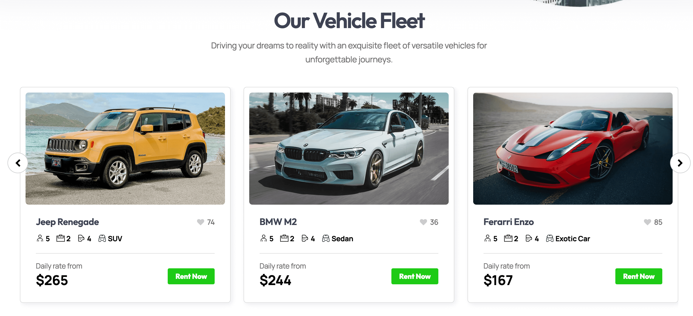

# 撰寫各頁面的 User Story

## 需求
> 需求分為靜態需求與動態需求

靜態需求為使用者想看到的內容，如網站中的文字、圖片、影音

動態需求為使用者想完成的任務，如登入、搜尋、租車等

以下列的主要是動態需求

## 訪客
- 我可以註冊會員，這樣我才能夠登入會員

- 我可以登入會員，以獲得會員相關權限並進行租車動作

- 我可以在首頁透過連結跳轉到車款列表，這樣就能看有哪些車可以租

- 我可以在首頁透過輪播圖的方式查看並選擇要租的車，這樣就不必到車款列表一一查看

- 我可以在首頁透過切換分頁的方式了解車款類型，以便了解是否有符合需求的車可以租

- 我可以在汽車列表頁篩選車款類型、價格，以便快速找到符合需求的車

- 我可以在汽車列表頁透過租車按鈕前往查看車款資訊，以便確認是否符合需求

- 我可以在單一汽車頁查看更多關於車輛的圖片，以便確認是否符合需求

- 我可以在單一汽車頁輸入租車相關資訊，以便開始租車的流程

- 我可以在租車頁面輸入租車相關資訊，以便找到符合需求的車款

## 會員
- 我可以在個人頁修改我的資料，以便維持最新狀態

- 我可以在個人頁調整是否接收通知，以便符合生活習慣

- 我可以在訂單頁看到訂單狀態，以便了解當前訂單情況

- 我可以在最愛車款頁看到收藏的車款，以便快速租到喜歡的車

- 我可以在個人頁登出，以便瀏覽器清除我的登入狀態
